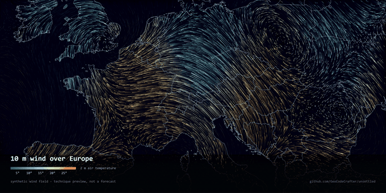

# unsettled

Renders weather as particle streamlines over exact coastlines, straight out to
4K video.



Every streak is a particle carried by the wind at that point, coloured by the
air temperature where it is. The trails aren't stored anywhere — the canvas is
faded a few percent each frame and drawn onto additively, so old strokes decay
on their own and crossing trails brighten instead of going muddy.

> The wind field in the preview above is **procedural**, not a real forecast.
> `fieldAt()` in `render/flow.js` is a stand-in so the renderer could be built
> and tuned without burning API quota. Point it at real data and nothing else
> changes.

## Why the geography is separate from the weather

The first version drew the coastline from the elevation value the forecast API
returns with each grid point. It seemed elegant — one request, no extra
dependency — and it was useless. At 0.75° a grid cell is about 80 km, so the
coast stair-stepped, anything smaller than a cell vanished, and a national
border was simply not expressible: that information isn't in a weather
response at all.

Coastlines and borders now come from [Natural Earth](https://www.naturalearthdata.com/)
1:10m vector polygons, rasterised to a land mask at full canvas resolution.
They're exact at any zoom and completely independent of however coarse the
forecast grid happens to be.

Land isn't a hard clip either. Particles live everywhere and simply dim to 15%
over water, so the flow doesn't stop dead at the shore and the coastline comes
out of contrast rather than a cut edge.

## Running it

```bash
npm install
npm run geo        # fetch and trim Natural Earth (~22 MB, once)
npm run flow       # 16s of 4K/60 -> docs/flow.mp4
npm run gif        # a much-reduced gif, for places that need one
```

`npm run flow:still` writes a single frame, which is far quicker when you're
tuning the look.

No API key and no account. [Open-Meteo](https://open-meteo.com/) is free for
non-commercial use and Natural Earth is public domain.

## Things that turned out to matter

**Particle count doesn't scale with area.** Ink on the canvas goes as count ×
stroke length × stroke width, and length and width already scale with
resolution. Scaling the count by area on top of that put roughly eight times
too much down, and 4K came out as a blown white sheet.

**H.264 can't encode an odd dimension.** The aspect-ratio maths landed on a
height of 623, x264 rejected every frame with a bare "invalid argument", and
ffmpeg wrote a zero-byte file. The canvas height is rounded to even now.

**Interpolate land-ness, not height.** Smoothing raw elevation and cutting at
half a metre puts the contour hard against each sea cell, because land samples
are hundreds of metres and the crossing happens immediately — which draws the
sample grid as a staircase. Reduce to 0/1 first and the boundary lands midway
between samples, where a coast actually is.

**GIF is the wrong container for this.** A straight 16-second conversion at
1000 px came out at 108 MB, against 52 MB for the whole thing as 1080p H.264.
`npm run gif` gives up half the duration, three quarters of the frame rate and
most of the width to get something postable.

## Also in here: forecast spread maps

The project started as something else — mapping how much an ensemble of
forecasts disagrees with itself, and how that disagreement grows with lead
time. `npm run fetch && npm run render` still does that.

The interesting result: score how often a randomly chosen land cell shows more
disagreement than a randomly chosen sea cell, where 0.5 means the field knows
nothing about geography and 1.0 is a perfect coastline. It runs **0.48 on day
one, 0.83 on day five, 0.95 on day seven**. Land and sea start indistinguishable
and end up 2.5:1 apart, because the sea is thermally sluggish and the land
isn't.

It's a real effect and the numbers hold up. It just doesn't make a good
picture — a smooth scalar field at that resolution reads as a blur no matter
what you do to it, which is what led to the particle renderer.

Two honest caveats on that half: ensemble spread is *underdispersive*, so it's
a floor on the uncertainty rather than a measure of it — a dark region is
somewhere the models agree, which isn't the same as somewhere they're right.
And it's one model, ICON, chosen for 40 members and good European coverage.

## How it's put together

```
render/flow.js         particles, land mask, borders, the key
render/render.js       the older scalar spread renderer
src/spread.mjs         type 7 quantiles, p90 - p10
scripts/trim-geo.mjs   fetch Natural Earth, cut to a Europe box
scripts/flow-video.mjs headless capture -> 4K/60 mp4
scripts/flow-gif.mjs   mp4 -> gif, two-pass palette
scripts/fetch.mjs      batched, throttled, resumable forecast fetch
```

Rendering happens in a headless Chromium rather than in Node, so the same
renderer can serve a web page later — and because getting a native canvas to
build on Windows is an afternoon nobody gets back.

The frame capture drives the simulation one step per output frame rather than
recording in real time, so 60fps is exact instead of sampled.

## Licence

MIT. Forecast data is Open-Meteo's, under their terms. Coastlines are Natural
Earth, public domain.
