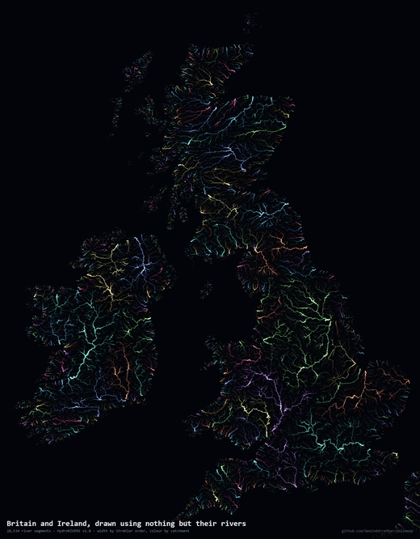
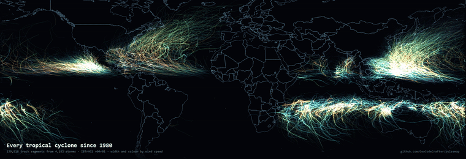
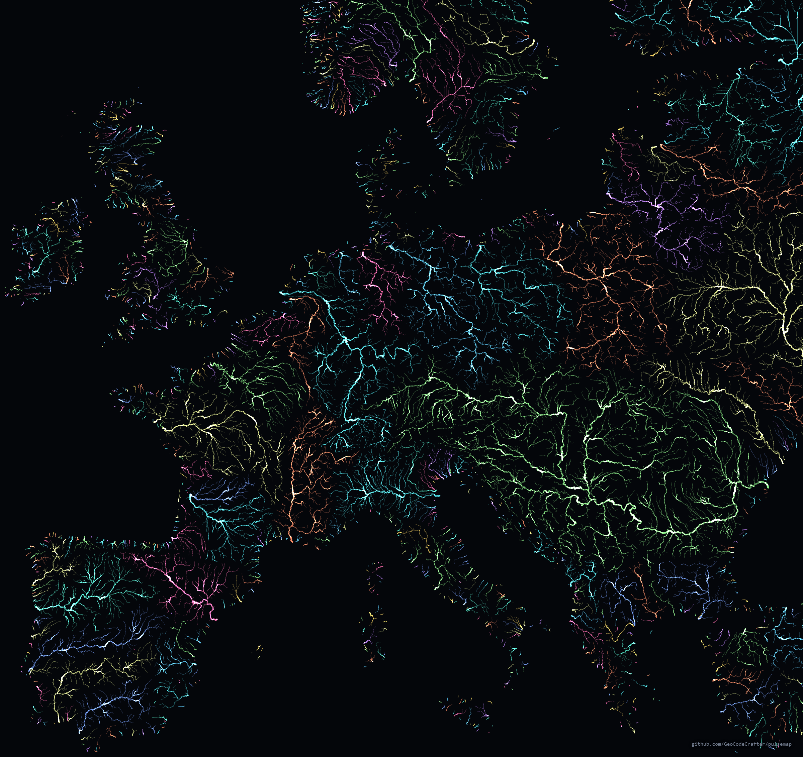
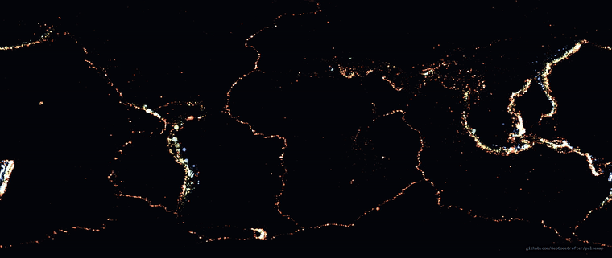
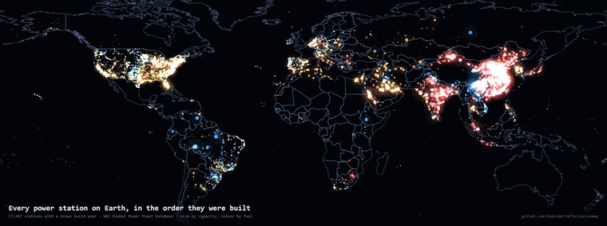
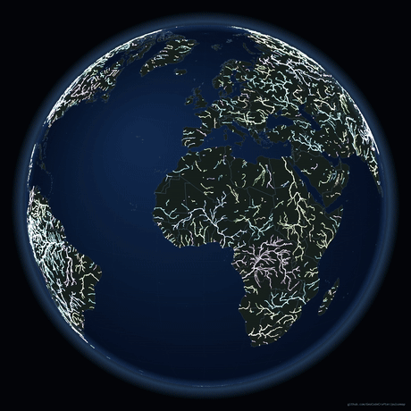
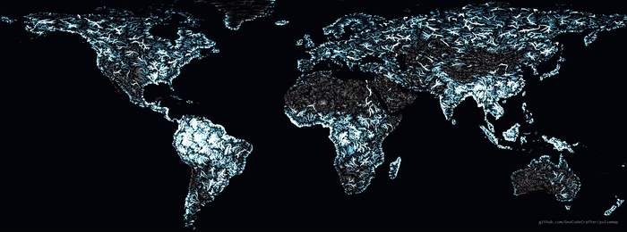
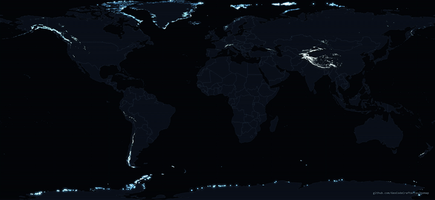
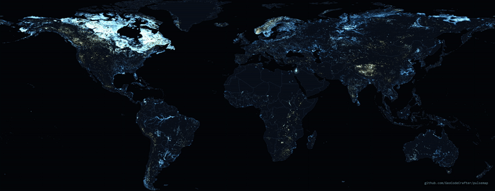

# pulsemap

Turn geospatial data into animated maps. Point it at a GeoJSON, say which
fields drive width, colour and the pulse, get a 4K loop.




There is no coastline in that image and no landmass. Every line is a river
segment. The islands appear because drainage fills the land and stops at the
sea, so the outline is a consequence of the data rather than something drawn
underneath it.

## The idea

A map like this is three mappings from data to ink:

| channel | takes | example |
| --- | --- | --- |
| **size** | a number | Strahler order to stroke width; magnitude to dot radius |
| **colour** | a number or a category | depth to a ramp; catchment id to a palette |
| **pulse** | an *ordering* | distance-to-sea; a timestamp |

The third one is why this is a tool rather than two scripts. A pulse is nothing
more than *"brighten the features whose value is near X, then sweep X"* — so
**any field that orders your data will animate it**, with no simulation
anywhere.

River segments carry their distance along the channel to the sea, so sweeping
that sends a wave down every river on the map at once, headwaters first,
estuaries last. Earthquakes carry a timestamp, so sweeping that replays years
of seismicity in the order it happened. Same code. It would equally take
elevation, depth, or the year a building went up.

Because the phase is taken modulo one, **the loop is seamless by
construction** — at `t = 1` every crest sits exactly where the previous one
stood at `t = 0`. No cross-fade, no hidden seam.

## Use it

```bash
npm install
npx playwright install chromium

npm run render configs/rivers-britain.json
```

That writes a full-size PNG, a GIF and a looping MP4 into `docs/`.

A config is the whole interface:

```jsonc
{
  "title": "Britain and Ireland, drawn using nothing but their rivers",
  "data": "data/rivers-britain.geojson",
  "kind": "lines",                     // or "points"
  "view":  { "north": 59.4, "south": 49.8, "west": -10.9, "east": 2.05 },

  "size":   { "field": "o", "base": 0.34, "exponent": 1.45 },
  "colour": { "field": "m", "mode": "categorical", "palette": [[96,210,255], ...] },
  "pulse":  { "field": "k", "mode": "cycle", "spacing": 76, "width": 0.115 }
}
```

`pulse.mode` is `cycle` for a quantity with no natural end — distance along a
river network keeps going, so several crests share the map at once — or `sweep`
for one with real bounds, like a date range, where a single window crossing
once is the whole story.

To use your own data, write a config pointing at your GeoJSON and name the
fields. Nothing in `render/pulsemap.js` knows what a river is.

### CSV

Most open data is published as a CSV with latitude and longitude columns rather
than as GeoJSON, so CSVs are read directly — no conversion step:

```jsonc
"data": "data/power-plants.csv",
"csv": {
  "lat": "latitude",
  "lon": "longitude",
  "require": ["commissioning_year", "capacity_mw"]
}
```

Every column becomes a property, numeric where it parses as a number, so any of
them can drive size, colour or the pulse.

`require` drops rows with an empty value in the named columns. That matters more
than it sounds: a plant with no commissioning year would otherwise become year
zero and sit permanently parked at the start of the pulse.

The parser handles quoting properly rather than splitting on commas — plant and
place names contain them constantly, and `"Nuevo Leon, Mexico"` would silently
shift every later column by one, which looks like bad data rather than a
parsing bug.

### Colour by name

When categories mean something, an explicit table beats hashing them to hues:

```jsonc
"colour": {
  "field": "primary_fuel",
  "mode": "lookup",
  "map": { "Coal": [255, 92, 88], "Hydro": [74, 158, 255], "Solar": [255, 226, 96] },
  "fallback": [150, 160, 180]
}
```

Hashing is fine for arbitrary ids like river catchment numbers. It is wrong for
fuels, where a reader expects coal and solar to look like coal and solar rather
than landing next to each other at random.

## What's here

**Britain and Ireland from rivers** — 28,534 segments from HydroRIVERS. Width
is Strahler order: a headwater with no tributaries is order 1, and the order
rises each time two streams of equal size meet, so thousands of hairlines feed
a handful of trunks. Colour is catchment, which makes watersheds appear as
colour boundaries along ridges nobody drew.

```bash
npm run rivers britain && npm run render configs/rivers-britain.json
```

**Europe from rivers** — 72,674 segments, the Danube and Rhine systems dominating.



```bash
npm run rivers europe && npm run render configs/rivers-europe.json
```

**Every earthquake since 2019** — 58,233 events, M4.5 and up, from the USGS
catalogue, pulsing in the order they occurred.



No coastlines and no plate boundaries are drawn — the boundaries appear because
that is where the crust moves. Colour is depth on the usual convention, shallow
warm and deep cold, and it earns its place: subduction zones show a colour
gradient across their width because the slab descends as it goes inland, which
you can watch happening along Japan, Tonga and South America.

The magnitude floor of 4.5 is deliberate. Below that the catalogue reflects
where the seismometers are rather than where the earth moves — California and
Japan blazing, the mid-Atlantic ridge barely present. At 4.5 global detection
is essentially complete.

```bash
npm run quakes && npm run render configs/quakes.json
```

**Every tropical cyclone since 1980** — 139,518 track segments from 4,182
storms, from the IBTrACS archive. Width and colour are both wind speed; the
pulse is day of the year, so one loop is one calendar year.

Because each segment carries its own date rather than the storm carrying one,
the pulse travels *along* a track as the storm actually moved. The northern
hemisphere season lights up, fades, and the southern takes over.

Two things fall straight out of it. There is a **clear empty band along the
equator** — a cyclone needs the Coriolis force to organise a rotation, and
within about 5 degrees of the equator there isn't enough of it. And the basins
separate on their own, with nothing drawn to divide them.

```bash
npm run cyclones && npm run render configs/cyclones.json
```

The first run downloads the 137 MB IBTrACS since-1980 archive. Two filters are
deliberate: since 1980 rather than the full record back to 1842, because
pre-satellite positions come from ship reports and landfall accounts, so the
older map shows shipping lanes more than storms; and only storms that reached
34 kt, because below that the record reflects how willing each agency was to
log a weak disturbance.

This one is the exception to drawing nothing but the data. Rivers draw their
own coastline and earthquakes draw the plate boundaries, so putting geography
underneath either would answer the question the picture is meant to raise.
Cyclone tracks sit over open ocean and form no recognisable shape, so without a
reference you genuinely cannot tell what you are looking at. Hence `basemap`:

```jsonc
"basemap": {
  "data": "data/world-countries.geojson",
  "colour": [132, 164, 206],
  "width": 0.9,
  "alpha": 0.85
}
```

It is drawn once, behind everything, and never animated — reference, not
subject. Polygons are stroked rather than filled, so country outlines give the
coast *and* the national borders from one file; a coastline set has no borders
in it at all. `npm run geo` fetches it at 1:50m rather than 1:10m, because the
finer set is three times the size in detail nothing can resolve behind data.

Do not make it as faint as looks right in a still. A low-contrast line on a
near-black ground is the first thing an H.264 encoder discards, so the first
version of this was visible in the PNG and simply gone from the mp4.

**Adding a dataset of your own** takes a prep script that writes GeoJSON and a
config naming the fields. The cyclone map needed one new config key and no
change to the rendering at all, which is the point of the three-channel design.

**Every power station on Earth, in the order they were built** — 17,447
stations with a recorded build year, from the WRI Global Power Plant Database.
Size is capacity, colour is fuel, and the pulse is commissioning year, so one
loop runs from 1896 to 2020.



Read straight from the CSV as WRI publishes it. Half the database has no build
year recorded and is dropped, so this is the history of the plants we have
dates for rather than a complete one.

```bash
npm run powerplants && npm run render configs/powerplants.json
```

### Globe

`"projection": "globe"` swaps the flat frame for an orthographic sphere, which
rotates once per loop:

```jsonc
"projection": "globe",
"view": { "north": 90, "south": -90, "west": -180, "east": 180 },
"globe": { "fill": 0.9, "tilt": 16, "spin": 1, "ocean": [11, 19, 34], "edge": [4, 7, 14] }
```



**Every major river on Earth** — 1,064,519 segments of Strahler order 4 and up,
water pulsing seaward, on a globe that turns once every thirty seconds.

```bash
npm run rivers world && npm run render configs/rivers-globe.json
```

The world file is a 519 MB download and takes a few minutes to walk: 8.5
million segments at every order, of which order 4 and up is kept.

A million line segments per frame is only viable because of the batching
described below — one `stroke()` per feature would be a million path
submissions a frame, and that, not the projection maths, is the ceiling on how
much detail a frame can hold.

Coverage is worth stating because it is the reason this subject was chosen:
latitude −54.6° to 82.9°, longitude complete, and every landmass present
roughly in proportion to its area. The
network is computed from a global elevation model rather than compiled from
national reporting, so it cannot have a country-shaped hole in it. Antarctica
is absent because it has no rivers.

Any existing config becomes a globe by changing that one line, so a dataset you
have already drawn flat is a second, genuinely different picture for free.

Four things it needs that a flat map does not:

**Nothing can be projected ahead of time.** Flat maps transform every vertex
once at load; here the projection depends on the rotation, so all of them are
transformed every frame. That is four trig calls per point and costs a few
milliseconds even at 280,000 vertices.

**Back-face culling.** Without a visibility test the far hemisphere draws
through the near one and South America sits on top of Asia. Lines break at the
horizon rather than drawing through the planet — a track running round the back
would otherwise appear as a chord straight across the disc.

**Filled countries need the limb.** A ring with nothing visible is skipped; a
ring straddling the horizon has its off-face points pushed out onto the limb,
which keeps it a closed shape instead of a torn one. A true spherical clip
would be exact and, at this line weight, indistinguishable.

**Curved graticules.** Straight meridians are correct only on the
equirectangular projection, so on a sphere they are walked in three degree
steps.

The ocean disc matters more than it looks: without it the land floats in the
same black as everything else and there is no planet, only scattered
continents. The radial gradient is what suggests curvature — a flat fill reads
as a sticker.

### Log scales

Some quantities span orders of magnitude. River discharge runs from nothing to
the Amazon's 205,000 cubic metres a second, with a median of 27 — mapped
linearly, everything on Earth except the Amazon lands in the first pixel of the
ramp:

```jsonc
"size":   { "field": "d", "scale": "log", "base": 0.5, "exponent": 1.15 },
"colour": { "field": "d", "mode": "ramp", "scale": "log", "stops": [ ... ] }
```

Stops stay in the field's real units so a config remains readable; only the
interpolation happens in log space. It uses `log10(1 + v)` rather than
`log10(v)` so a genuine zero is zero rather than negative infinity — and 5% of
river segments carry no water at all, so that case is not hypothetical.

**Every river on Earth, coloured by how much water it carries**



Same 1,064,519 segments as the globe, coloured by long-term mean discharge
instead of by catchment. The Sahara, Arabia, central Australia and the Kalahari
have dense, fully formed drainage networks that are almost entirely dry — 46%
of segments inside the Sahara have a mean discharge of about zero, against 5%
worldwide. The Nile crosses it as a single bright thread.

```bash
npm run rivers world && npm run render configs/rivers-discharge.json
```

**Every glacier on Earth, by altitude** — 274,531 from the Randolph Glacier
Inventory v7, a complete global inventory. Size is area, colour and pulse are
median elevation, so the wave climbs from sea-level ice to 8,116 m.



Watch it climb and the snow line rises toward the equator in front of you.
Antarctica, Greenland and the Arctic islands go first, at sea level. Alaska,
Norway and Patagonia next. By the time the wave reaches 5,000 m everything on
the planet has gone dark except the Himalaya, the Karakoram and Tibet. The
median glacier worldwide sits at 3,717 m.

Read straight from the published CSV, no conversion. The source is the OGGM
mirror because the official NSIDC distribution needs an Earthdata login and
the older GLIMS path is gone.

```bash
npm run glaciers && npm run render configs/glaciers.json
```

**Every lake on Earth, by altitude** — 1,427,688 from HydroLAKES, each with an
area and an elevation, none dropped.



North America holds 995,769 of them — more than the rest of the world put
together. That is not a survey artefact: HydroLAKES uses a uniform ten hectare
threshold everywhere. It is glaciation, and the bright zone stops in a hard
line across the northern United States which is the Last Glacial Maximum ice
margin, drawn by nothing but lake positions.

```bash
npm run lakes && npm run render configs/lakes.json
```

### Making the ground less bare

Outlines alone leave the continents as empty as the sea. Two optional layers
fill that in without competing with the data:

```jsonc
"basemap": {
  "data": "data/world-countries.geojson",
  "colour": [120, 154, 200], "width": 0.8, "alpha": 0.55,
  "fill": { "colour": [13, 20, 33], "alpha": 1 },
  "glow": { "width": 7, "alpha": 0.12, "passes": 3 }
},
"graticule": { "step": 15, "colour": [74, 100, 134], "alpha": 0.13 }
```

The graticule is drawn *before* the land fill, so the grid shows over water
only — over everything it competes with the data, over ocean it just stops the
empty half of the frame being a void.

Fills are applied per country rather than as one path. `evenodd` on a combined
path treats two overlapping country polygons as a hole and punches them out of
each other; per feature the same rule correctly cuts only interior rings.

The rivers and earthquakes deliberately have neither. Those two draw their own
geography out of the data, and putting land underneath would answer the
question the picture exists to raise.

### Pulse width is in the field's own units

`spacing x width` is the size of a crest **in whatever the pulse field
measures**. On the Britain map, distance-to-sea in kilometres, that came to
about 9 km — several pixels at that zoom, and clearly visible.

The same numbers on a globe produce a crest narrower than a pixel: one pixel is
around 33 km on a 1200 px Earth, so the pulse disappeared entirely and looked
like it was not working. On a world view the crest needs to be hundreds of
kilometres wide. Check it against your pixel scale, not against what looked
right somewhere else.

## Two knobs worth knowing about

**`pulse.tail`** makes the crest asymmetric — a sharp leading edge with a long
decay behind it. A symmetric crest brightens and dims features in place, which
reads as blinking; a tail reads as something travelling, which for storm tracks
is what is actually happening. `1` is symmetric, `4.5` is what the cyclone map
uses.

**`glow`** draws a wide dim pass under the sharp one, so bright features bleed
light instead of ending at a hard edge:

```jsonc
"glow": { "width": 4, "alpha": 0.055, "min": 75 }
```

`min` is a threshold on the size field — bloom every faint feature and you
double the draw calls to add light nobody can see, so only the strong ones earn
it. Keep `alpha` low: this composites additively on top of everything already
there, and at 0.16 the busy basins blew out to flat white.

## Things that turned out to matter

**Precompute everything that doesn't change between frames.** With tens of
thousands of features redrawn per frame there is no budget to reproject
coordinates or evaluate a colour ramp each time. Almost all of a naive
version's time went on exactly that.

**Additive blending, not alpha compositing.** Overlapping features should
accumulate light. A confluence of a hundred streams, or a subduction zone
holding thousands of events, then reads brighter than a lone feature — which is
real information rather than a flat wash of whatever drew last.

**Never render `t = 1`.** It is the same picture as `t = 0`, and including both
makes the loop hitch for exactly one frame.

**H.264 with 4:2:0 chroma cannot encode an odd dimension.** The aspect-ratio
maths landed on a height of 623 and x264 rejected every frame with a bare
"invalid argument" while ffmpeg wrote a zero-byte file. Canvas height is
rounded to even.

**Don't hash categories to hue.** Random colours per catchment read as noise
however good the geometry is. A short hand-picked palette keeps the image
coherent and still tells neighbours apart, which is all the colour has to do.

**Check the longitude convention before trusting a global file.** IBTrACS
mixes them between contributing agencies — most report −180 to 180, some report
0 to 360, and the file runs to 266 as a result. Every western Pacific storm was
being drawn off the right-hand edge of the map. Worse, the bug hid itself: with
nothing sitting near 180, the dateline-crossing check found nothing to skip and
reported a clean zero.

**Cosine-correct regional maps, don't correct world ones.** A degree of
longitude at 55°N is about 0.57 of a degree of latitude — without the
correction Britain comes out nearly twice as wide as it should be. On a
whole-world frame there is no single latitude to correct at, so plate carrée it
is, and the poles stretch.

## Layout

```
render/pulsemap.js   the engine - projection, channels, pulse, annotation
render/index.html    the page it draws into
configs/*.json       one file per map
scripts/render.mjs   headless capture -> png, gif, mp4
scripts/rivers.mjs   HydroRIVERS shapefile -> regional GeoJSON
scripts/quakes.mjs   USGS catalogue -> GeoJSON
scripts/cyclones.mjs IBTrACS best-track archive -> GeoJSON
scripts/powerplants.mjs  downloads the WRI database, unmodified
```

Rendering happens in a headless Chromium rather than in Node, so the same
engine can serve a web page later, and because getting a native canvas to build
on Windows is an afternoon nobody gets back. Frames are driven one at a time
rather than filmed, so output is exact at any frame rate — an earlier version
recorded a live animation and produced a stuttering four frames a second.

## Data

- Rivers: [HydroRIVERS v1.0](https://www.hydrosheds.org/products/hydrorivers)
- Earthquakes: [USGS Earthquake Catalog](https://earthquake.usgs.gov/fdsnws/event/1/)
- Cyclones: [IBTrACS v04r01](https://www.ncei.noaa.gov/products/international-best-track-archive) (NOAA NCEI)
- Power stations: [WRI Global Power Plant Database](https://github.com/wri/global-power-plant-database)
- Coastlines, where used: [Natural Earth](https://www.naturalearthdata.com/) (public domain)

`data/rivers-britain.geojson` is committed so a clone renders immediately. The
larger datasets are gitignored and rebuilt by the scripts above.

## Licence

MIT.
